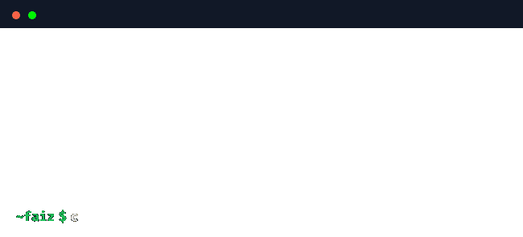

  

  &nbsp;&nbsp;
  
  <h1><b>About</b></h1>
  

  <h1><b>Stack</b></h1>

  <h3>
    <b>
      &nbsp;&nbsp;&nbsp;&nbsp;&nbsp;&nbsp;Languages
      &nbsp;&nbsp;&nbsp;&nbsp;&nbsp;&nbsp;&nbsp;&nbsp;&nbsp;&nbsp;&nbsp;Front-End
      &nbsp;&nbsp;&nbsp;&nbsp;&nbsp;&nbsp;&nbsp;MERN (Learning)
    </b>
  </h3>

  
  &nbsp;&nbsp;&nbsp;&nbsp;&nbsp;&nbsp;&nbsp;&nbsp;&nbsp;&nbsp;&nbsp;&nbsp;
  
  &nbsp;&nbsp;&nbsp;&nbsp;&nbsp;&nbsp;&nbsp;&nbsp;&nbsp;&nbsp;&nbsp;&nbsp;
  

  <h3><b>Tooling</b></h3>
    

  <h1><b>Stats</b></h1>
  

  <h2>
    <b><i>builtbyfaiz • built to last</i></b>
  </h2>

  

    
    
    
    
  

