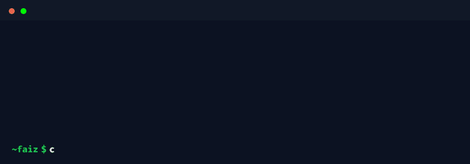

  

&nbsp;
&nbsp;

# **About**

 

# **Stack**

### **&nbsp;&nbsp;&nbsp;&nbsp;&nbsp;&nbsp;Languages &nbsp;&nbsp;&nbsp;&nbsp;&nbsp;&nbsp;&nbsp;&nbsp;&nbsp;&nbsp;&nbsp;&nbsp; Front-End &nbsp;&nbsp;&nbsp;&nbsp;&nbsp;&nbsp;&nbsp; MERN (Learning)**

&nbsp;&nbsp;&nbsp;&nbsp;&nbsp;&nbsp;&nbsp;&nbsp;&nbsp;&nbsp;&nbsp;&nbsp;

&nbsp;&nbsp;&nbsp;&nbsp;&nbsp;&nbsp;&nbsp;&nbsp;&nbsp;&nbsp;&nbsp;&nbsp;

### **Tooling**

  

# **Projects**

*More projects coming soon.*
[→ View all repositories](https://github.com/builtbyfaiz?tab=repositories)

  

# **Stats**

 &nbsp;&nbsp;&nbsp;&nbsp;&nbsp;
  

## **_builtbyfaiz • built to last_**

  
  
  
  

> **Logic before libraries.** 
> **Foundations before frameworks.** 
> **Building things because they should exist**

  

